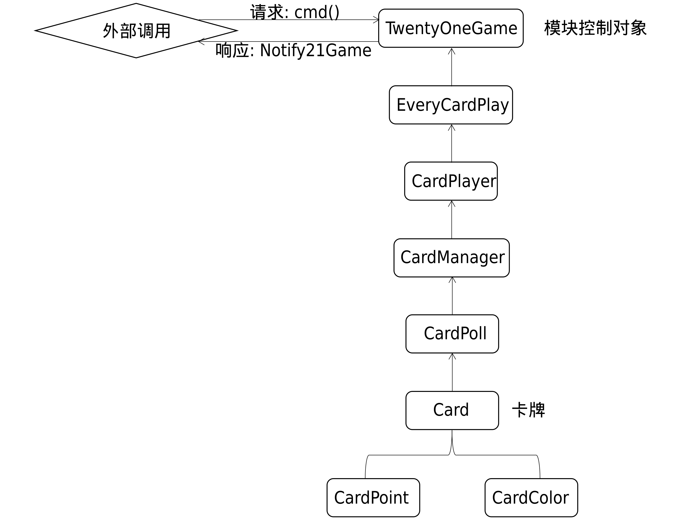

# 21点小游戏模块
本项目是用java写的一个21点卡牌小游戏模块。

## 如何使用本模块

1.将代码下载到你的项目中

2.在你的代码中实现Game21Notify接口

3.创建一个游戏对象: TwentyOneGame game = new Game21Notify(this);

4.请求: 任何请求使用game.cmd()调用模块api

5.响应: 模块内部有结果，会通过Game21Notify接口的backHandle函数回调（在 创建TwentyOneGame对象时会需要该接口），你需要实现对应接口（步骤2）并且处理回调的信息

## 模块结构

[by: 樱桃大丸子](https://github.com/BigCherryBall)
